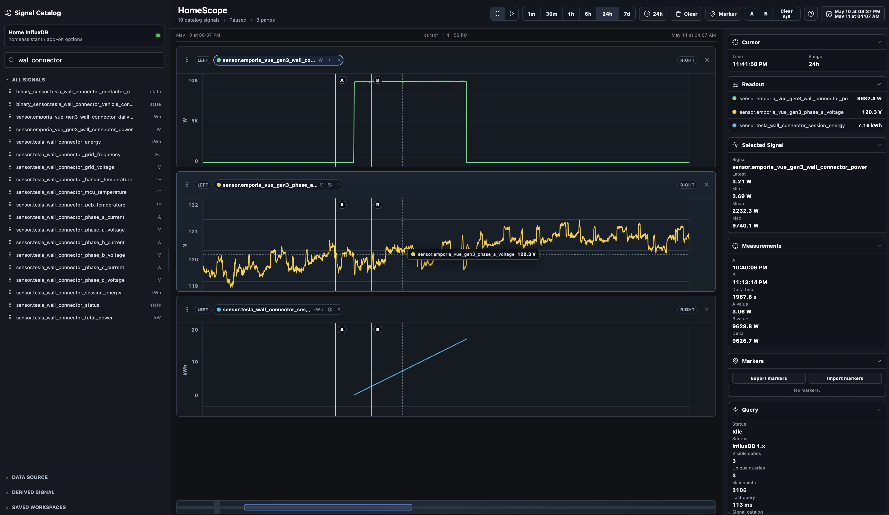

# HomeScope

HomeScope is a Home Assistant add-on for exploring time-series data stored in InfluxDB 1.x. It is built for dense signal analysis: searchable entities, draggable chart panes, dual axes, cursor readouts, zooming, panning, markers, A/B measurements, state transition overlays, and browser-local saved workspaces.



## Requirements

- Home Assistant with add-on support.
- An InfluxDB 1.x server containing Home Assistant history data.
- A dedicated InfluxDB user with read access to the Home Assistant database.

HomeScope is designed to work with the community InfluxDB add-on. The default add-on URL is:

```text
http://a0d7b954-influxdb:8086
```

If your InfluxDB server runs somewhere else, use that server URL in the HomeScope options.

## Install InfluxDB

1. In Home Assistant, open **Settings** -> **Add-ons** -> **Add-on Store**.
2. Install the community **InfluxDB** add-on.
3. Start the InfluxDB add-on.
4. Confirm Home Assistant is writing data to an InfluxDB 1.x database, usually named `homeassistant`.
5. Create a dedicated InfluxDB user for HomeScope.
6. Grant that user read permission on the `homeassistant` database.

HomeScope only needs read access. Do not reuse an administrator account unless you are temporarily troubleshooting.

## Install HomeScope

1. In Home Assistant, open **Settings** -> **Add-ons** -> **Add-on Store**.
2. Open the menu in the top right and choose **Repositories**.
3. Add this repository.
4. Refresh the add-on store.
5. Install **HomeScope**.
6. Open the **Configuration** tab for HomeScope.
7. Set the InfluxDB options.
8. Start HomeScope.
9. Open HomeScope from the Home Assistant sidebar.

## Configuration

| Option | Description |
| --- | --- |
| `influx_url` | InfluxDB 1.x server URL. Use `http://a0d7b954-influxdb:8086` for the community add-on on the same Home Assistant host. |
| `influx_database` | InfluxDB database name. The default is `homeassistant`. |
| `influx_username` | InfluxDB user with read access to the database. |
| `influx_password` | Password for the InfluxDB user. |

Example:

```yaml
influx_url: "http://a0d7b954-influxdb:8086"
influx_database: "homeassistant"
influx_username: "homescope"
influx_password: "your-password"
```

Password values stay on the HomeScope server. The browser only receives redacted connection status.

## First Run Check

After starting the add-on:

1. Open HomeScope from the Home Assistant sidebar.
2. Confirm the source card says **Home InfluxDB**.
3. Search for a known entity or sensor.
4. Click or drag a signal into the chart area.
5. Confirm real data appears in the chart.

If HomeScope is not fully configured, it shows a setup state and fixture signals. If the configuration is present but the connection fails, it shows a safe connection error without exposing the password.

## Features

- Searchable signal catalog using Home Assistant entity names.
- Click or drag signals into chart panes.
- Duplicate signals and same-unit overlays.
- Dual-axis panes for comparing two units in one time-aligned view.
- Numeric and state-signal rendering.
- Shared time viewport, presets, custom ranges, overview scrubber, and live/pause mode.
- Horizontal, vertical, and diagonal drag zoom.
- Keyboard pan and zoom controls.
- Cursor readouts and selected-signal statistics.
- A/B measurement cursors.
- Markers with import/export.
- Event overlays from state transitions.
- Browser-local saved workspaces.
- Per-signal styling and axis controls.

## Notes

- HomeScope currently targets InfluxDB 1.x.
- Saved workspaces are stored in the browser that opens HomeScope.
- Credentials are stored in Home Assistant add-on options, not in saved workspaces.
- The add-on slug is `homescope`.
